# GAME JAN : DON HUMANO

## Curso : Computación Gráfica (CC431-A)


## Docente : Montalvo Garcia Peter Jonathan

## Integrantes

- Pineda Garcia Diego Ronaldo
- Torres Fuero Mateo Lorenzo
- Trujillo Serva Luis Andre

## Descripción

Siguiendo la premisa de **La vida da vueltas como un pollo a la brasa** . Realizamos un videojuego emulando un restaurante con giro surrealista. En este mundo, los pollos son los dueños del negocio y los humanos son el ingrediente. El jugador controla a un pollo cocinero que debe atender pedidos dentro de un límite de tiempo, completando minijuegos para preparar cada plato.

Tendremos 3 minijuegos :

1. Horno : Minijuego basado en Guitar Hero , el jugador debe completar la cantidad de aciertos que se muestra en pantalla.
2. Corte : Minijuego que simula el corte basado en cada pedido , se genera un ejercicio de mecanografía , si el jugador se equivoca en una letra , el ejercicio se reinicia.
3. Maiz : Minijuego que simula desgranar una mazorca , el jugador debe presionar `space` hasta que llegue al 100%.

Además , el juego tiene diferentes niveles y conforme aumente cada uno de ellos , incrementa la dificultad y además surgen bonificaciones y penalizaciones con el tiempo y dinero.

## Ejecución

Para lograr la ejecución de nuestro videojuego realizamos las siguientes acciones.

Realizamos la instalación de **uv** en el siguiente enlace : [uv_installation](https://docs.astral.sh/uv/getting-started/installation/#standalone-installer)
```bash
uv sync
uv run python main.py
```

Versión instalada: `pygame 2.6.1`

Verificar instalación :
```bash
uv run python -c "import pygame; print(pygame.version.ver)"
```


### Pantalla de inicio

<p align="center">
    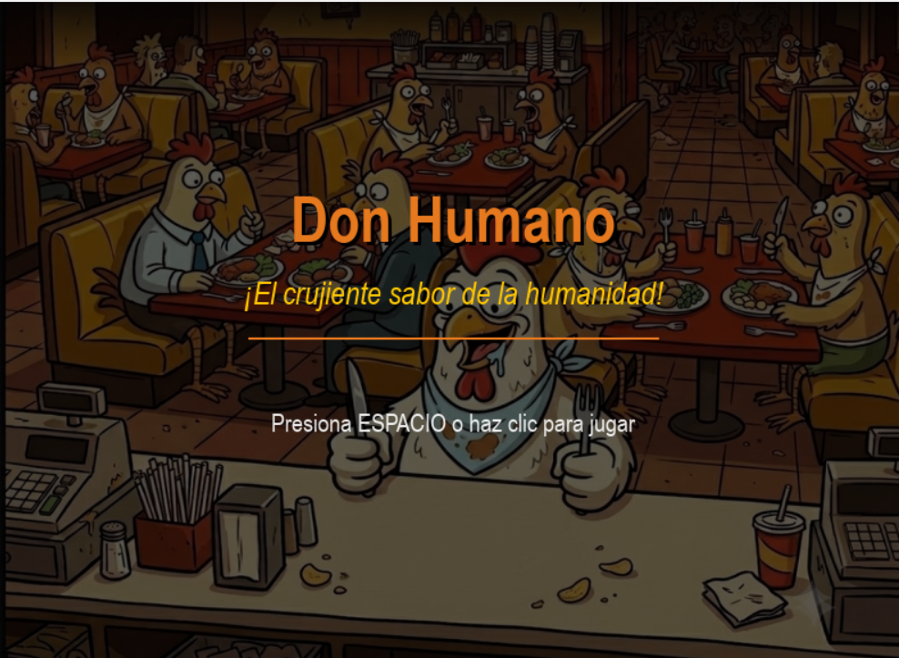
<p/>

### Pantalla de juego (Nivel 01)

<p align="center">
    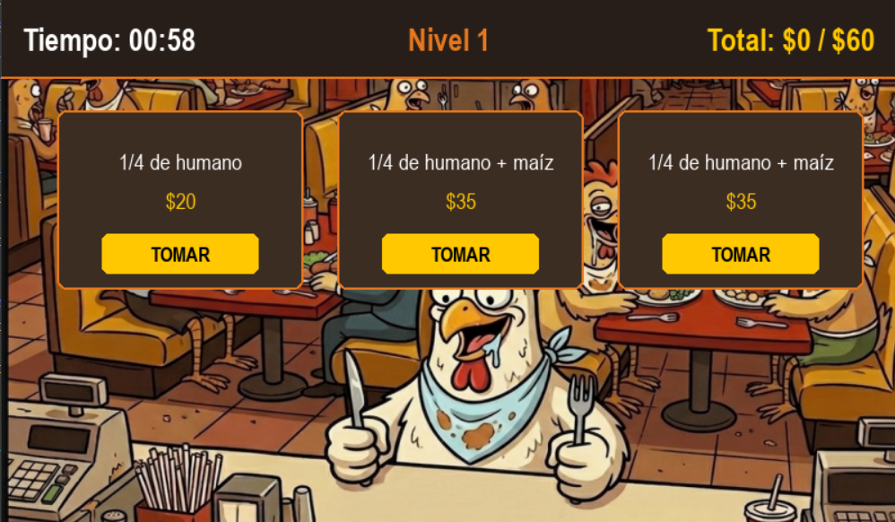
<p/>

### Animación de pedido de un cliente

<p align="center">
    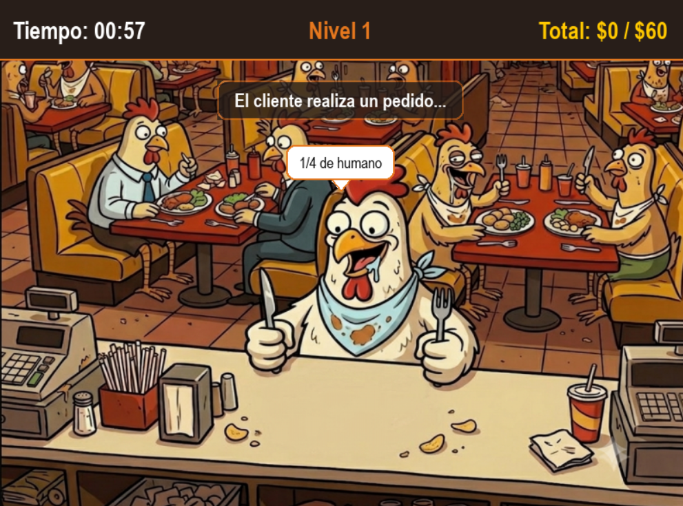
<p/>

### Primer minijuego : Horno

<p align="center">
    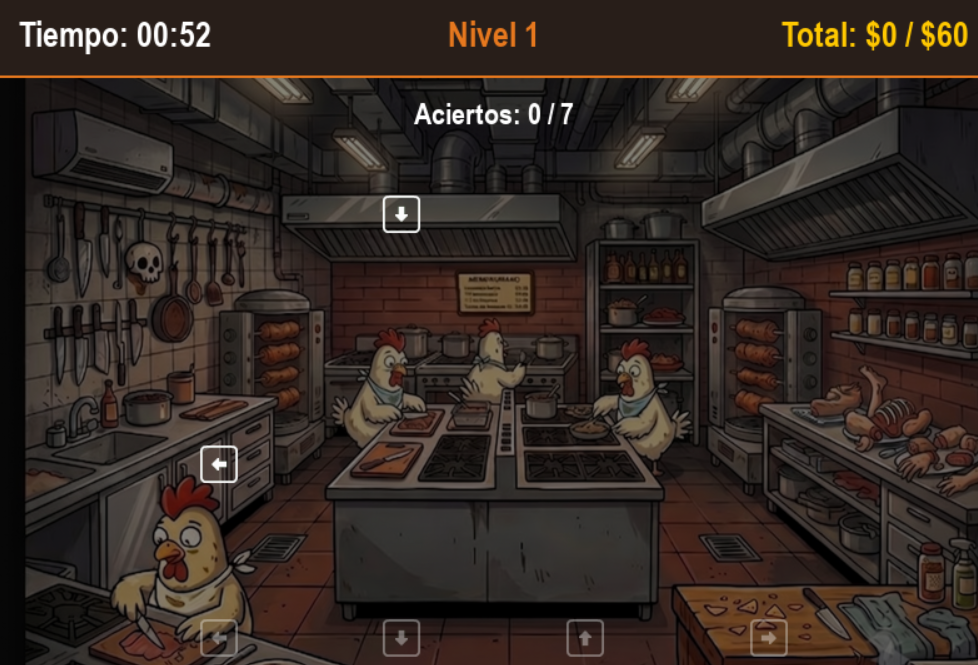
<p/>

### Segundo minijuego : Corte


<p align="center">
    
<p/>

### Tercer minijuego : Maiz

<p align="center">
    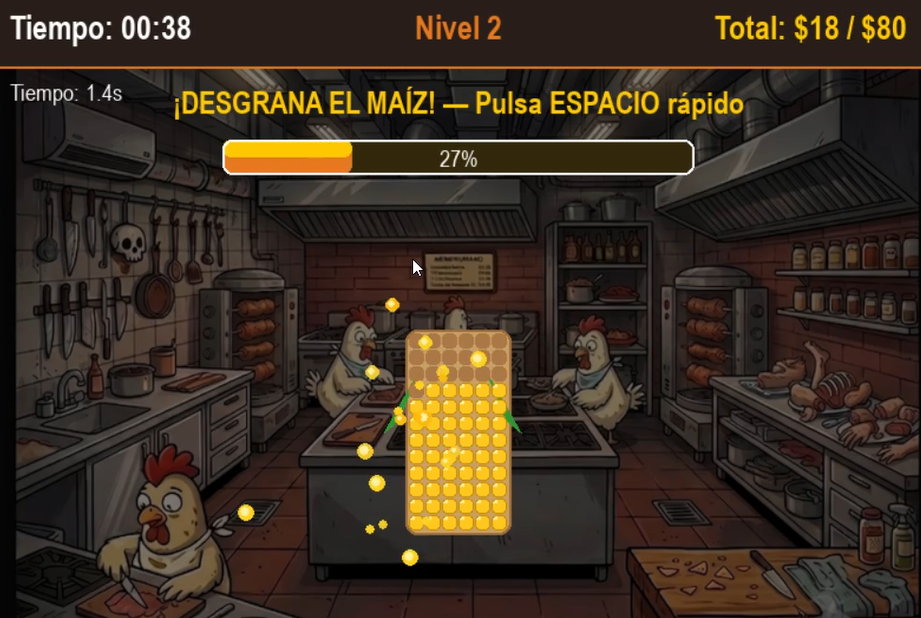
<p/>

### Resultado : Pedido completado con éxito

<p align="center">
    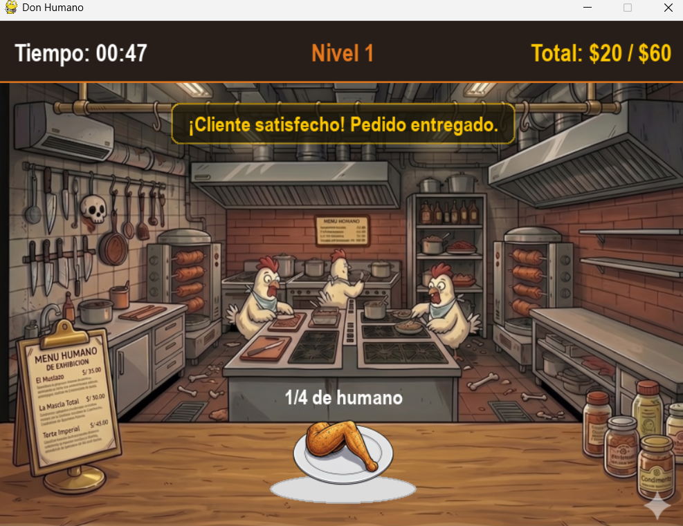
<p/>

### Resultado : Cliente insatisfecho

<p align="center">
    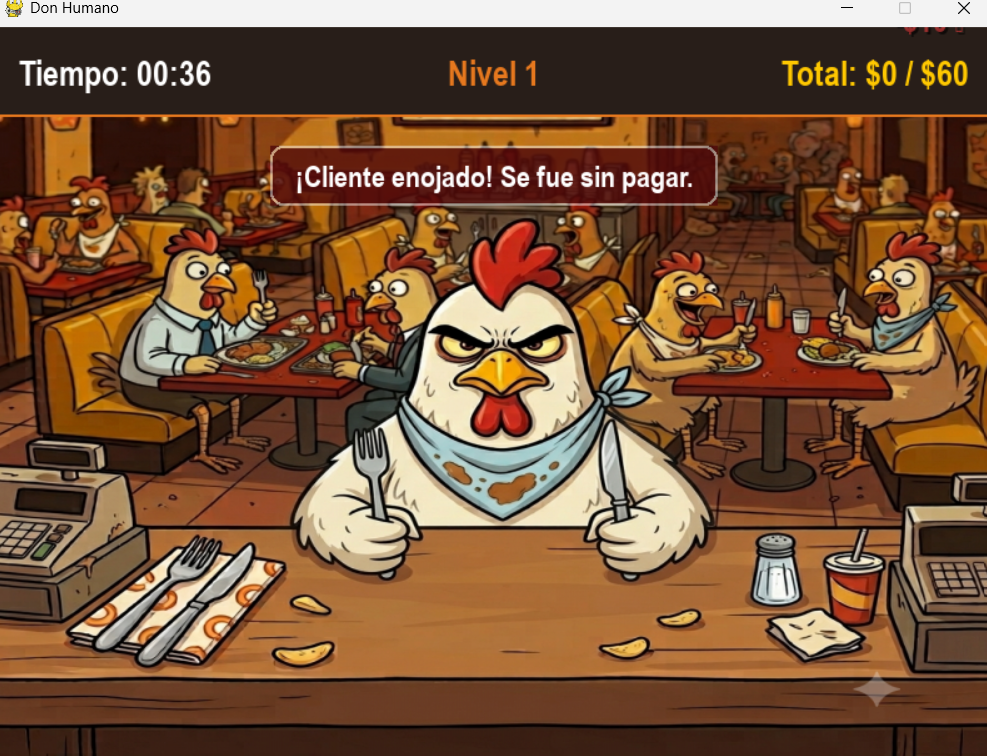
<p/>

### Fin de cada nivel : Victoria

<p align="center">
    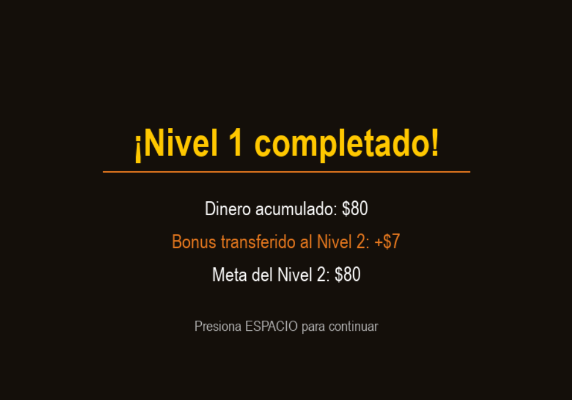
<p/>

### Fin del juego

<p align="center">
    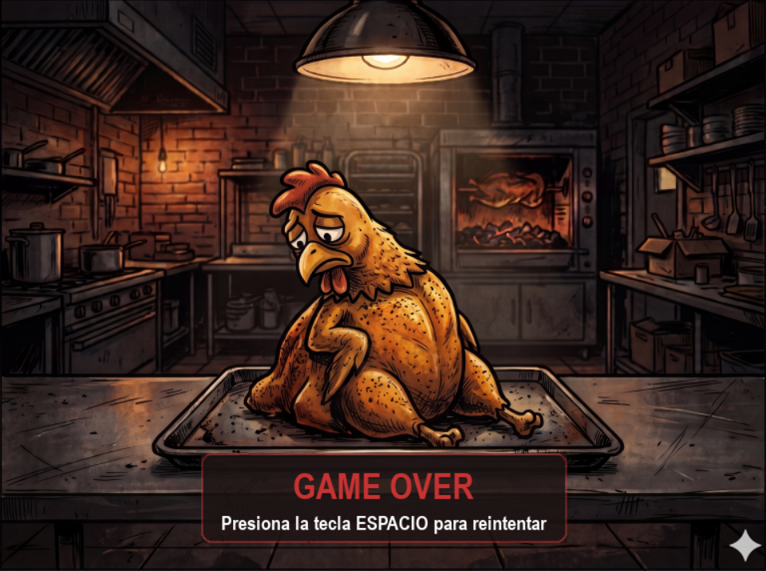
<p/>

### Penalizaciones y bonos

Para el caso de tiempo , se da una bonificación si gana un minijuego y lo contraria cuando no termina dicho minijuego . Para el caso del dinero , en caso falle un minijuego se descuenta la ganancia de dicho pedido.

<p align="center">
    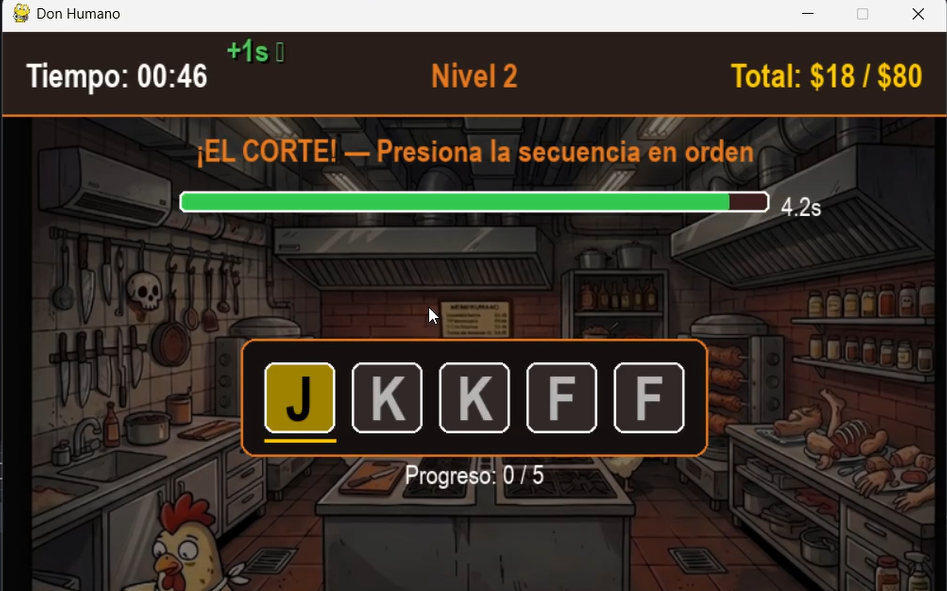
<p/>

<p align="center">
    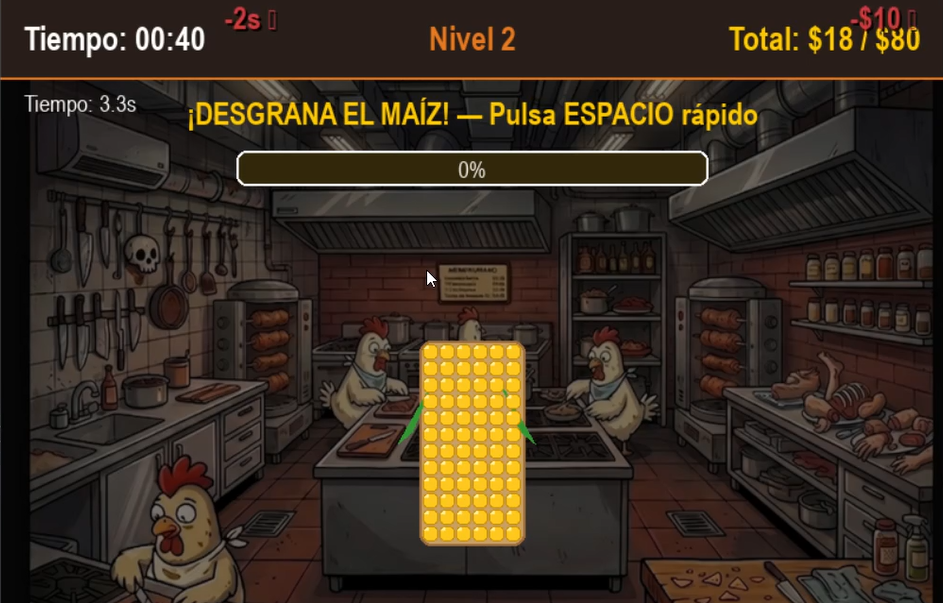
<p/>

### Dificultad

A mayor nivel se incrementa la dificultad de los minijuegos . En este caso , estamos mostrando el aumento de dificultad en el minijuego **corte**.

<p align="center">
    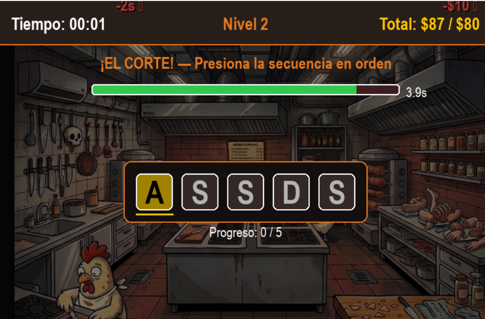
<p/>

<p align="center">
    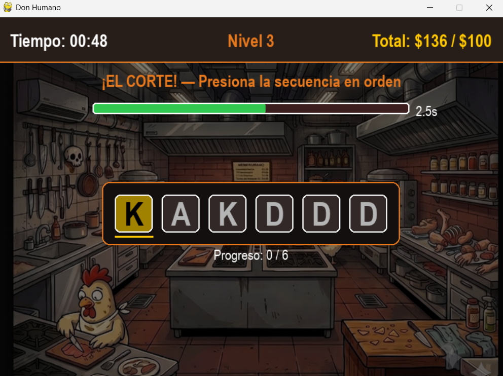
<p/>

